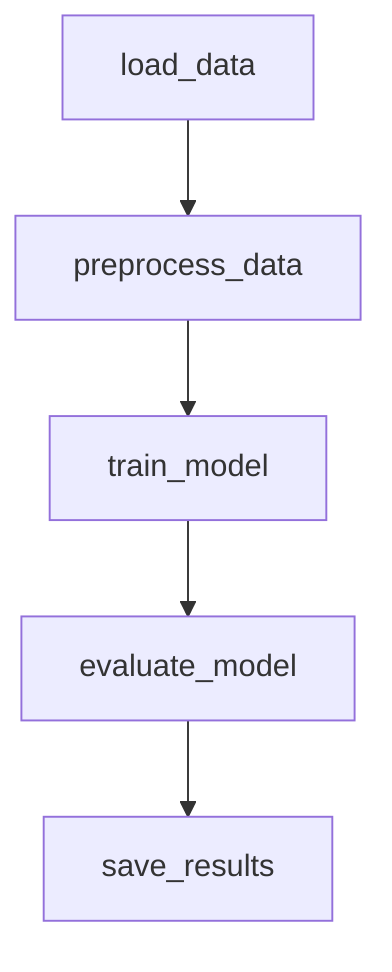

# Breast_Cancer_ETL-: Breast Cancer Classification

## Цель
Разработать ML-ETL пайплайн для бинарной классификации опухолей (доброкачественная/злокачественная) на основе датасета с медицинскими признаками опухоли.

---

## Этапы ETL

### 1. Загрузка
- Чтение CSV-файла `data.csv`
- Очистка и преобразование данных

### 2. Преобразование (Preprocessing)
- Удаление ID
- Конвертация целевой переменной: M = 1, B = 0
- Стандартная нормализация (StandardScaler)

### 3. Обучение
- LogisticRegression (max_iter=1000)
- Обучение на всех данных

### 4. Оценка
- Accuracy
- Precision
- Recall
- F1-score

### 5. Сохранение
- Модель: `results/model.pkl`
- Метрики: `results/metrics.json`

---

## DAG: Apache Airflow

DAG `pipeline_dag.py` описывает этот пайплайн как цепочку PythonOperator:



- Каждая функция из etl/*.py вызывается через PythonOperator
- DAG не планируется (запуск вручную)

---

## Устойчивость к ошибкам

| Этап | Возможная ошибка | Решение |
|-------|-----------------------------|-------------|
| load  | Нет `data.csv`            | try/except + логгинг |
| preprocess | Нестандартные данные | dropna, проверки типов |
| train | Необходимо больше итераций | Увеличить max_iter |
| save  | Нет папки results/        | os.makedirs + проверка |

---

## Идеи для развития

- Кросс-валидация (GridSearchCV)
- Выгрузка результатов в Google Drive / Dropbox / S3
- Airflow: retries, SLA, XCom
- MLflow / Neptune.ai для логгирования экспериментов

---

## Состав папок

```
project/
├── data.csv
├── results/
│   ├── model.pkl
│   └── metrics.json
├── dags/
│   └── pipeline_dag.py
├── etl/
│   ├── load_data.py
│   ├── preprocess.py
│   ├── train_model.py
│   ├── evaluate.py
│   └── save_results.py
├── test.py
└── README.md
```

---

## Запуск 
```bash
export AIRFLOW_HOME=~/airflow
airflow db init
airflow users create --username admin --password admin --role Admin \
  --firstname Nail --lastname Gar --email test@example.com
airflow webserver --port 8080
```

---

## Датасет
Используется Breast Cancer Wisconsin Diagnostic (UCI):
https://archive.ics.uci.edu/ml/datasets/Breast+Cancer+Wisconsin+(Diagnostic)
